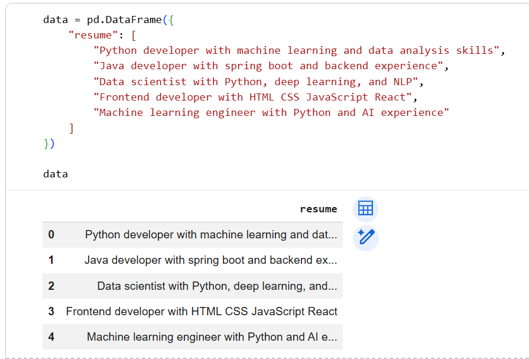
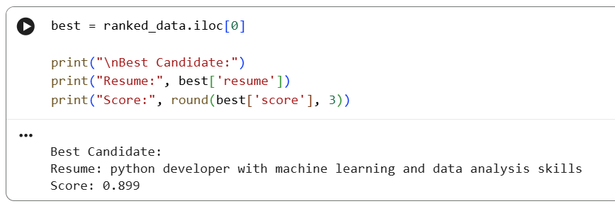

# Resume Screening System using Machine Learning

## Project Overview

This project is a Resume Screening System that automatically analyzes and ranks resumes based on a given job description using Machine Learning techniques.

## Objective

To help recruiters identify the most suitable candidates by comparing resumes with job requirements and highlighting skill gaps.

## Technologies Used

* Python
* Pandas
* Scikit-learn
* TF-IDF Vectorizer
* Cosine Similarity

## Key Features

* Resume text preprocessing (cleaning & parsing)
* Skill extraction from resumes
* Matching resumes with job description
* Candidate ranking based on similarity score
* Skill gap identification (missing skills)

## How It Works

1. Convert resumes and job description into numerical vectors using TF-IDF
2. Calculate similarity using cosine similarity
3. Rank candidates based on matching score
4. Identify matched and missing skills

## Output

* Ranked list of candidates
* Best candidate selection
* Skill analysis (matched & missing skills)

## Example Insight

Candidates with higher similarity scores are more suitable for the job role.

## Screenshots

### 🔹 Candidate Ranking

### 🔹 Skill Analysis

### 🔹 Best Candidate

## 🔗 Conclusion

This system helps automate resume screening, making the hiring process faster and more efficient.

---

